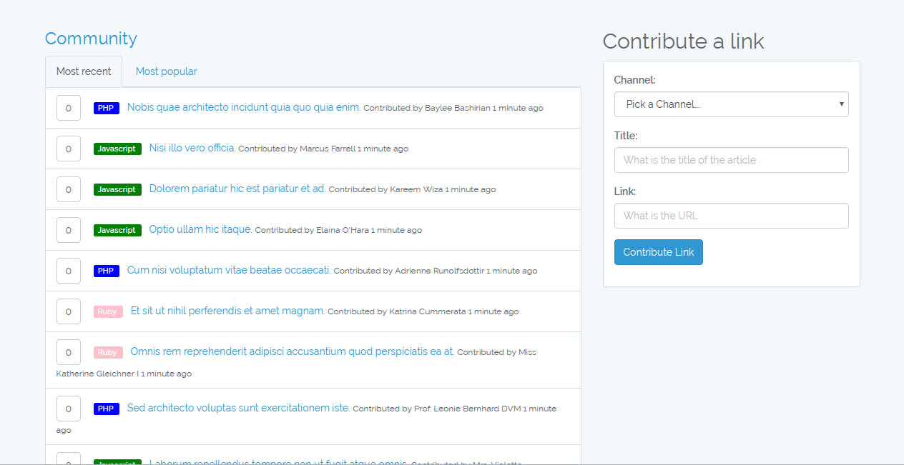
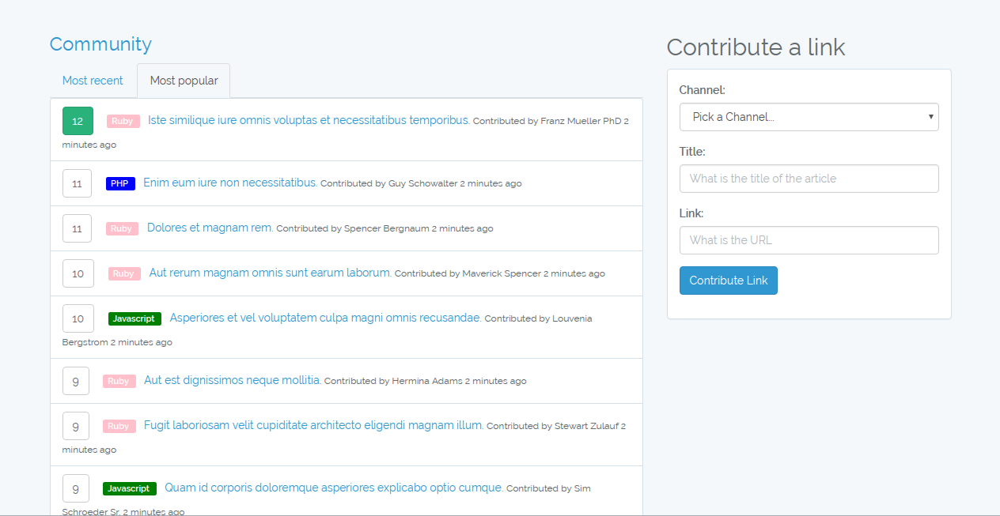

# Popularity

A voting app where you can submit your own links in specific channels and the other users can vote on them.

To use this repo clone it to your computer, rename env.example to .env and modify it according to your database and then run the commands 

```sh
$ php artisan migrate
$ php artisan db:seed
```

to migrate the database and populate it.



